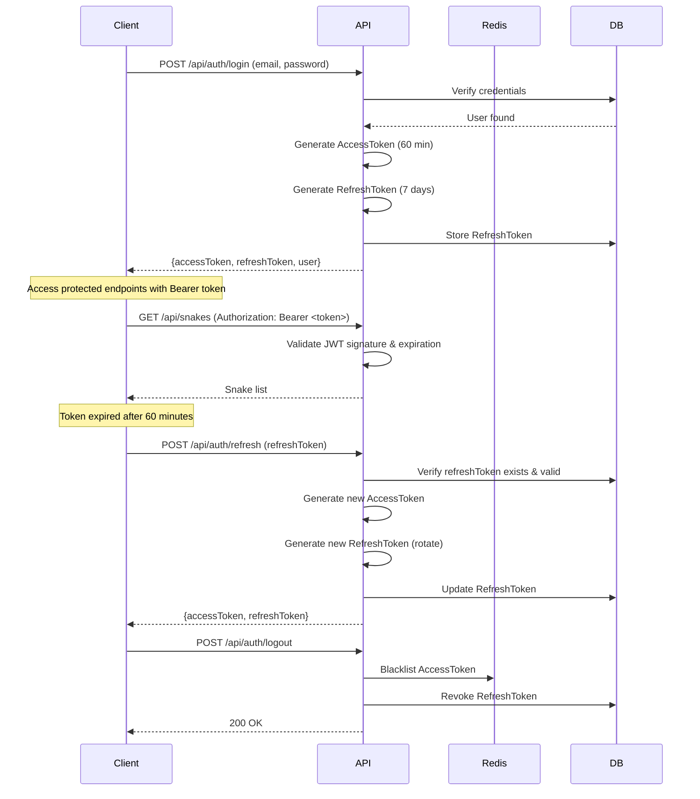

# 🐍 SFARS - Snake First Aid Response System

[](https://dotnet.microsoft.com/)
[](LICENSE)
[](ARCHITECTURE.md)

**SFARS Backend** is the RESTful API core for the SFARS ecosystem - An AI-powered platform for snakebite identification, first aid guidance, and emergency rescue coordination. Built as a capstone project (SEP490) using Clean Architecture principles.

## 🎯 Overview

SFARS provides a comprehensive solution for snakebite emergencies in Vietnam, leveraging AI-powered snake identification, real-time rescue coordination, and expert-guided first aid instructions. The system integrates:

- 🤖 **AI-Powered Snake Identification** using YOLO object detection
- 💬 **RAG-based Chatbot** with Google Gemini for first aid guidance
- 📍 **Real-time Location Tracking** via SignalR with Redis backplane  
- 🚑 **Emergency Rescue Coordination** connecting victims, rescuers, and medical facilities
- 📊 **Comprehensive Snake Database** with toxicity levels and treatment protocols
- 🔐 **Multi-factor Authentication** with JWT + OTP via email

## ✨ Key Features

### 🎯 Core Functionality
- **Snake Identification Service**: Upload snake photos → YOLO inference → candidate ranking → first aid recommendations
- **AI Chatbot**: Context-aware Q&A using RAG (Retrieval-Augmented Generation) with vector embeddings
- **Incident Management**: Create SOS incidents → match rescuers → track rescue missions → log outcomes
- **Location-Based Matching**: Find nearby rescuers and medical facilities using geospatial queries
- **Real-time Updates**: SignalR hubs for live location tracking and incident notifications

### 🛡️ Security & Authentication
- JWT-based authentication with refresh token rotation
- Multi-factor authentication (MFA) via email OTP
- Role-based access control (Admin, User, Rescuer)
- Token blacklisting for secure logout
- Password recovery with time-limited tokens

### 📊 Admin & Monitoring
- Admin audit logging for sensitive operations
- Health check endpoints for monitoring
- Comprehensive error handling middleware
- Structured logging with Serilog

## 🏗️ Architecture

The project follows **Clean Architecture** with clear separation of concerns across 4 layers:

```
┌─────────────────────────────────────────────────────────────┐
│                        SFARS.API                            │
│  Controllers | Middlewares | DI Composition Root | SignalR  │
└────────────────────────────┬────────────────────────────────┘
                             │
┌────────────────────────────┴────────────────────────────────┐
│                    SFARS.Application                        │
│  Services | DTOs | Validations | Mappings | Events/MediatR  │
└────────────────────────────┬────────────────────────────────┘
                             │
┌────────────────────────────┴────────────────────────────────┐
│                   SFARS.Infrastructure                       │
│  EF Core | Repositories | Redis | External APIs | SignalR   │
└────────────────────────────┬────────────────────────────────┘
                             │
┌────────────────────────────┴────────────────────────────────┐
│                      SFARS.Domain                           │
│  Entities | Interfaces | Specifications | Value Objects     │
└─────────────────────────────────────────────────────────────┘
```

**Key Design Patterns**: Repository, Unit of Work, Specification, Mediator (MediatR), CQRS, Result Object Pattern, Event-Driven Architecture

📖 **For detailed architecture documentation, see [ARCHITECTURE.md](./ARCHITECTURE.md)**

## 🔧 Tech Stack

| Category | Technologies |
|----------|-------------|
| **Framework** | .NET 9.0, ASP.NET Core Web API |
| **Database** | SQL Server (EF Core 9.0) |
| **Caching** | Redis (StackExchange.Redis) |
| **Real-time** | SignalR with Redis backplane |
| **AI/ML** | YOLO (Python microservice), Google Gemini API |
| **Authentication** | JWT, OAuth 2.0 (Google) |
| **ORM** | Entity Framework Core 9.0 |
| **Validation** | FluentValidation |
| **Mapping** | Mapster |
| **Logging** | Serilog |
| **Storage** | Cloudinary (images/videos) |
| **Email** | SMTP (Brevo) |
| **Testing** | xUnit, Moq, FluentAssertions |
| **CI/CD** | GitHub Actions *(planned)* |

## 📦 Project Structure

```
SFARS/
├── SFARS.API/                    # API Layer (Controllers, Middlewares, DI)
│   ├── Controller/               # RESTful API endpoints
│   ├── Middlewares/              # ExceptionHandling, RequestLogging
│   ├── Extension/                # Service configuration extensions
│   └── Program.cs                # Application entry point
│
├── SFARS.Application/            # Application Layer (Use Cases, Services)
│   ├── Services/                 # Business logic services
│   ├── Dtos/                     # Data Transfer Objects
│   ├── Validations/              # FluentValidation validators
│   ├── Mappings/                 # Mapster mapping configurations
│   ├── Events/                   # MediatR domain events & handlers
│   └── DependencyInjection.cs    # Application services registration
│
├── SFARS.Domain/                 # Domain Layer (Core Business Logic)
│   ├── Entities/                 # Domain entities (Snake, Incident, User, etc.)
│   ├── Interfaces/               # Repository and service interfaces
│   ├── Specifications/           # Query specifications
│   ├── Models/                   # Value objects and domain models
│   └── Common/                   # Enums, constants, base classes
│
├── SFARS.Infrastructure/         # Infrastructure Layer (Data Access, External Services)
│   ├── Data/                     # DbContext, UnitOfWork, EF configurations
│   ├── Repositories/             # Repository implementations
│   ├── Services/                 # External service implementations (Redis, Cloudinary)
│   ├── Hubs/                     # SignalR hubs
│   ├── Migrations/               # EF Core database migrations
│   └── DependencyInjection.cs    # Infrastructure services registration
│
├── SFARS.Tests/                  # Unit & Integration Tests
│   ├── Application/              # Application layer tests
│   │   └── Services/             # Service tests (ChatService, SnakeService, etc.)
│   └── SFARS.Tests.csproj        # Test project configuration
│
├── Data/                         # Seed data
│   └── snakes_master_seed.csv    # Snake species master data
│
├── PromptSystem/                 # Documentation & Analysis
│   ├── ARCHITECTURE.md           # Architecture documentation
│   ├── SFARS_SOURCE_BASE_ANALYSIS.md
│   └── checkpoints/              # Development checkpoints
│
├── ARCHITECTURE.md               # Detailed architecture & design patterns
├── README.md                     # This file
├── SFARS.sln                     # Visual Studio solution
└── LICENSE                       # MIT License
```

## 🚀 Getting Started

### Prerequisites

- [.NET 9.0 SDK](https://dotnet.microsoft.com/download/dotnet/9.0)
- [SQL Server 2019+](https://www.microsoft.com/sql-server) (or SQL Server Express)
- [Redis](https://redis.io/download) (for caching and SignalR backplane)
- (Optional) [Visual Studio 2022](https://visualstudio.microsoft.com/) or [VS Code](https://code.visualstudio.com/)

### Installation

1. **Clone the repository**
   ```bash
   git clone https://github.com/yourusername/SFARS-Backend.git
   cd SFARS-Backend
   ```

2. **Configure application settings**
   
   Copy the example configuration files:
   ```bash
   cd SFARS.API
   copy appsettings.example.json appsettings.json
   copy appsettings.Development.example.json appsettings.Development.json
   ```

3. **Update configuration**
   
   Edit `appsettings.json` and `appsettings.Development.json`:

   ```json
   {
     "ConnectionStrings": {
       "DefaultConnection": "Server=localhost;Database=SFARS_DB;Trusted_Connection=True;TrustServerCertificate=True",
       "Redis": "localhost:6379,abortConnect=false"
     },
     "WebTokenSettings": {
       "IssuerSigningKey": "YOUR_SECURE_SECRET_KEY_MIN_64_CHARACTERS_LONG"
     },
     "GoogleAuthSettings": {
       "ClientId": "YOUR_GOOGLE_CLIENT_ID"
     },
     "CloudinarySettings": {
       "CloudName": "YOUR_CLOUDINARY_CLOUD_NAME",
       "ApiKey": "YOUR_CLOUDINARY_API_KEY",
       "ApiSecret": "YOUR_CLOUDINARY_API_SECRET"
     },
     "EmailSettings": {
       "SmtpHost": "smtp-relay.brevo.com",
       "SmtpPort": 587,
       "SmtpCredential": {
         "UserName": "YOUR_SMTP_USERNAME",
         "Password": "YOUR_SMTP_PASSWORD"
       },
       "From": "YOUR_EMAIL@gmail.com"
     }
   }
   ```

4. **Restore NuGet packages**
   ```bash
   dotnet restore
   ```

5. **Apply database migrations**
   ```bash
   cd SFARS.API
   dotnet ef database update --project ../SFARS.Infrastructure
   ```

6. **Seed initial data** *(optional - seeds snake database)*
   ```bash
   # Run seed command or import Data/snakes_master_seed.csv
   ```

7. **Run the application**
   ```bash
   dotnet run --project SFARS.API
   ```

   The API will be available at:
   - HTTPS: `https://localhost:7001`
   - HTTP: `http://localhost:5001`
   - Swagger UI: `https://localhost:7001/swagger`

### Using Visual Studio

1. Open `SFARS.sln` in Visual Studio 2022
2. Set `SFARS.API` as the startup project
3. Update `appsettings.json` with your configuration
4. Press `F5` to run with debugging

### Using VS Code

1. Open the workspace folder in VS Code
2. Install C# Dev Kit extension
3. Press `F5` or use the integrated terminal:
   ```bash
   dotnet run --project SFARS.API
   ```

## 🧪 Running Tests

The project includes comprehensive unit tests with **xUnit**, **Moq**, and **FluentAssertions**.

```bash
# Run all tests
dotnet test

# Run tests with coverage
dotnet test --collect:"XPlat Code Coverage"

# Run specific test project
dotnet test SFARS.Tests/SFARS.Tests.csproj

# Run tests in watch mode
dotnet watch test --project SFARS.Tests
```

**Current Test Coverage**: 60%+ (253 tests passing)

Test categories:
- ✅ **ChatService** (22 tests) - AI chatbot with RAG
- ✅ **SnakeService** (20 tests) - Snake CRUD with audit logging
- ✅ **AiInferenceService** (14 tests) - ML inference pipeline
- ✅ **RescuerService** (13 tests) - User + RescuerProfile management
- *More test suites in progress...*

## 📡 API Documentation

### Swagger/OpenAPI

Once the application is running, access interactive API documentation at:

**[https://localhost:7001/swagger](https://localhost:7001/swagger)**

### Main API Endpoints

| Endpoint | Description |
|----------|-------------|
| `POST /api/auth/login` | User login (email + password) |
| `POST /api/auth/google` | Google OAuth authentication |
| `POST /api/auth/otp/send` | Send OTP for MFA |
| `GET /api/snakes` | Get snake species list |
| `POST /api/snakes` | Create new snake entry (Admin) |
| `POST /api/ai-inference/upload` | Upload snake image for identification |
| `GET /api/ai-inference/{id}` | Get AI inference result |
| `POST /api/chat/sessions` | Create new chat session |
| `POST /api/chat/sessions/{id}/message` | Send message to chatbot |
| `POST /api/incidents` | Create SOS incident |
| `GET /api/incidents/{id}` | Get incident details |
| `POST /api/rescuer/rescue-missions/{id}/accept` | Accept rescue mission |
| `GET /api/facilities/nearby` | Find nearby medical facilities |
| `GET /api/health` | Health check endpoint |

**SignalR Hubs:**
- `/hubs/location` - Real-time location tracking
- `/hubs/incident` - Real-time incident updates *(planned)*

## 🔐 Authentication Flow



## 🔥 Key Features Deep Dive

### 1. AI-Powered Snake Identification

**Workflow**: Upload → YOLO Detection → Candidate Ranking → First Aid Mapping

```csharp
// Upload snake image
POST /api/ai-inference/upload
Content-Type: multipart/form-data
{
    "file": <image file>,
    "location": { "latitude": 10.762622, "longitude": 106.660172 }
}

// Response
{
    "inferenceId": "guid",
    "predictions": [
        {
            "snakeName": "Cobra",
            "confidence": 0.95,
            "boundingBox": { "x": 100, "y": 150, "width": 200, "height": 300 }
        }
    ],
    "topCandidate": {
        "snake": { "scientificName": "Naja kaouthia", "riskLevel": "High" },
        "firstAidInstructions": "..."
    }
}
```

### 2. RAG-based Chatbot (Google Gemini)

**Features**: Context-aware responses, chat history, snake identification from text

```csharp
// Create chat session
POST /api/chat/sessions
Response: { "sessionId": "guid" }

// Send message
POST /api/chat/sessions/{sessionId}/message
{
    "message": "Tôi bị rắn cắn, phải làm gì?"
}

// Response
{
    "response": "Đầu tiên, hãy giữ bình tĩnh và gọi cấp cứu ngay...",
    "messageId": "guid",
    "timestamp": "2026-03-08T10:30:00Z"
}
```

### 3. Real-time Location Tracking (SignalR)

```javascript
// Client-side (JavaScript)
const connection = new signalR.HubConnectionBuilder()
    .withUrl("https://api.sfars.com/hubs/location")
    .build();

// Send location update
await connection.invoke("UpdateLocation", {
    latitude: 10.762622,
    longitude: 106.660172,
    accuracy: 15
});

// Receive nearby rescuers
connection.on("NearbyRescuersUpdated", (rescuers) => {
    console.log("Nearby rescuers:", rescuers);
});
```

## 📊 Database Schema (Key Entities)

- **Users** - System users (Victim, Rescuer, Admin roles)
- **RescuerProfiles** - Extended profile for rescuers (vehicle, availability, service area)
- **Snakes** - Snake species database (230+ species)
- **FirstAidDetails** - Treatment protocols per snake species
- **Incidents** - SOS emergency incidents
- **RescueMissions** - Rescue tracking (Rescuer ↔ Incident)
- **AiInferences** - Snake identification inference results
- **AiInferenceCandidates** - Ranked snake candidates per inference
- **ChatSessions / ChatMessages** - Chatbot conversation history
- **MedicalFacilities** - Hospitals and clinics database
- **AdminAuditLogs** - Audit trail for sensitive operations

**Schema Diagram**: See `PromptSystem/02_DOMAIN_ENTITIES.md` for detailed ERD

## 🛠️ Development

### Code Style & Conventions

- Follow [Microsoft C# Coding Conventions](https://docs.microsoft.com/en-us/dotnet/csharp/fundamentals/coding-style/coding-conventions)
- Use `async/await` for all I/O operations
- Prefer `record` types for DTOs
- Use FluentValidation for input validation
- Return `ServiceResult<T>` from service methods
- Use Specification Pattern for complex queries

### Adding a New Feature

1. **Define Entity** in `SFARS.Domain/Entities/`
2. **Create Repository Interface** in `SFARS.Domain/Interfaces/Repositories/`
3. **Implement Repository** in `SFARS.Infrastructure/Repositories/`
4. **Add EF Configuration** in `SFARS.Infrastructure/Data/Configurations/`
5. **Create Migration**: `dotnet ef migrations add AddNewFeature --project SFARS.Infrastructure`
6. **Define DTOs** in `SFARS.Application/Dtos/`
7. **Add Validator** in `SFARS.Application/Validations/`
8. **Create Service** in `SFARS.Application/Services/`
9. **Add Controller** in `SFARS.API/Controller/`
10. **Write Tests** in `SFARS.Tests/Application/Services/`

### Database Migrations

```bash
# Add migration
dotnet ef migrations add MigrationName --project SFARS.Infrastructure --startup-project SFARS.API

# Apply migration
dotnet ef database update --project SFARS.Infrastructure --startup-project SFARS.API

# Revert migration
dotnet ef database update PreviousMigration --project SFARS.Infrastructure --startup-project SFARS.API

# Remove last migration (if not applied)
dotnet ef migrations remove --project SFARS.Infrastructure --startup-project SFARS.API

# Generate SQL script
dotnet ef migrations script --project SFARS.Infrastructure --startup-project SFARS.API --output migration.sql
```

### Troubleshooting

**Build Errors:**
```bash
# Clean and rebuild
dotnet clean
dotnet build

# Clear NuGet cache
dotnet nuget locals all --clear
dotnet restore
```

**Database Issues:**
```bash
# Drop and recreate database
dotnet ef database drop --project SFARS.Infrastructure --startup-project SFARS.API --force
dotnet ef database update --project SFARS.Infrastructure --startup-project SFARS.API
```

**Redis Connection Issues:**
- Ensure Redis server is running: `redis-cli ping` (should return `PONG`)
- Check connection string in `appsettings.json`

## 🔍 Monitoring & Health Checks

**Health Check Endpoints:**
```bash
# Overall health
GET /health
Response: Healthy / Unhealthy

# Detailed health
GET /health/details
Response:
{
  "status": "Healthy",
  "checks": {
    "sqlserver": "Healthy",
    "redis": "Healthy",
    "api": "Healthy"
  }
}
```

## 🤝 Contributing

We welcome contributions! Please follow these steps:

1. Fork the repository
2. Create a feature branch (`git checkout -b feature/AmazingFeature`)
3. Commit your changes (`git commit -m 'Add some AmazingFeature'`)
4. Push to the branch (`git push origin feature/AmazingFeature`)
5. Open a Pull Request

**Before submitting:**
- Ensure all tests pass: `dotnet test`
- Follow code style conventions
- Update documentation if needed
- Add tests for new features

## 📝 License

This project is licensed under the MIT License - see the [LICENSE](LICENSE) file for details.

## 👥 Team

**SEP490 Capstone Project - Group 11**

- **Project Type**: Snake First Aid Response System
- **Academic Year**: 2024-2025
- **University**: FPT University
- **Course**: SEP490 - Software Engineering Capstone Project

## 📧 Contact

For questions or support, please contact:
- **Email**: support@sfars.com
- **Issues**: [GitHub Issues](https://github.com/yourusername/SFARS-Backend/issues)

## 🙏 Acknowledgments

- Google Gemini AI for RAG-based chatbot
- YOLO object detection framework
- Clean Architecture by Robert C. Martin
- All open-source libraries used in this project

---

<p align="center">
  Made with ❤️ by SFARS Team | <a href="ARCHITECTURE.md">Architecture Documentation</a>
</p>
